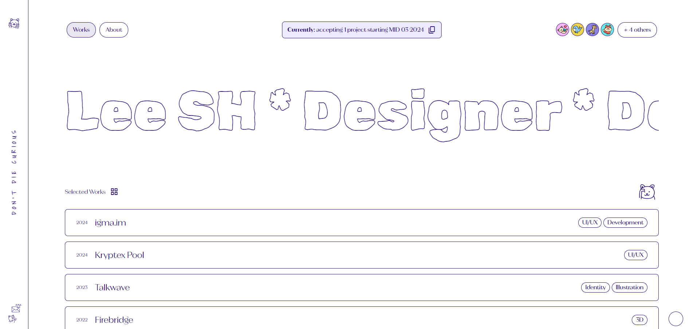
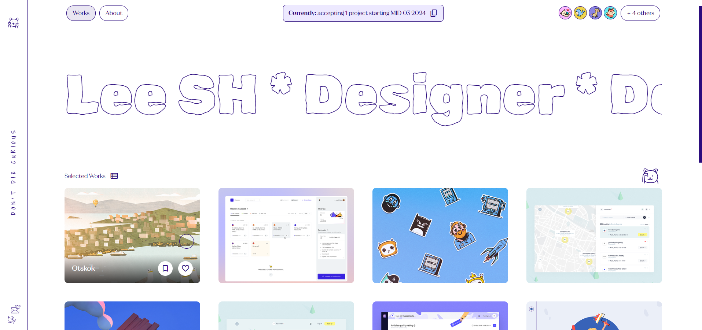
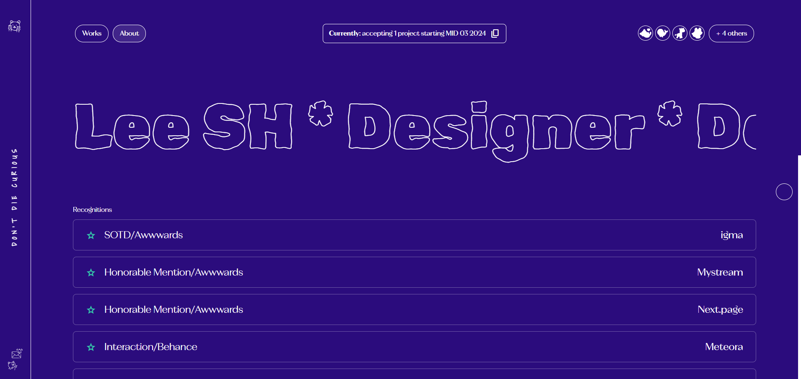
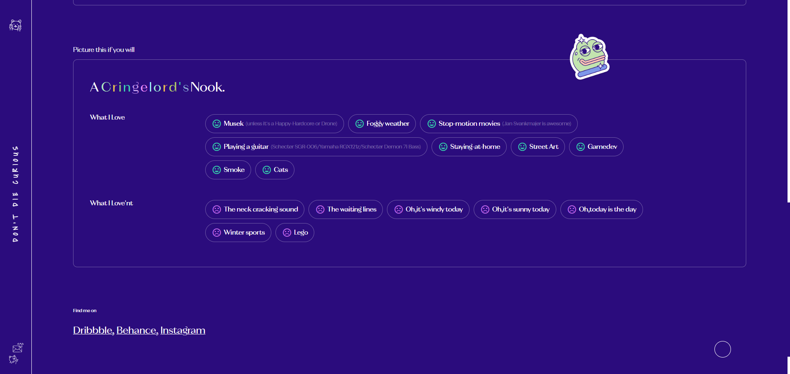
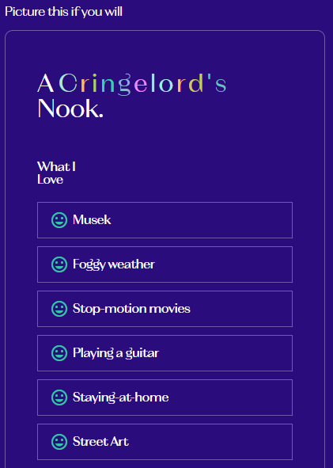

# 👨‍💻 포트폴리오 페이지 클론코딩
[포트폴리오 페이지](https://igma.im/) 
[클론 코딩 페이지](https://secret-spire-33120-3e71e4352387.herokuapp.com/pages/index.html) 
포트폴리오 페이지 클론 코딩을 진행하였으며 구현하기  힘든 부분은 수정했습니다.
Works, About 두 페이지를 작업했습니다.  기초적인 flex, grid 을 사용해 레이아웃을 구성했으며
여러 가지 애니메이션을 사용해 보는 데  초점을 두고 진행했습니다. 
반응형 웹으로 만들었습니다. 
___
### 기간
📆 24.02.19 ~ 24.02.24
___
### 페이지 소개 
#### 1. Work 페이지

##### 헤더 부분
- 왼쪽에 위치한 헤더를 `position:fixed` 로 고정하고 메인에 `padding`을 줘서 전체적인 레이아웃 구성
- 로고 부분에 마우스를 올리면 영역 내에서 마우스를 따라다니는 동작 구현
- 'DON't DIE CURIOUS' 에 마우스를 올리면 글자가 각각 위아래로 움직이는 동작 구현
- 메일 아이콘을 클릭 했을 때 아이콘이 기울어지고, 모달이 나오는 동작 구현

#### 메인 부분
- 가운데 글에 마우스 올렸을 때 왼쪽으로 이동하는 움직임 구현
- 프로젝트 내부 `display:flex`로 레이아웃 구성 
- 스크롤 했을 때 selected works 부분이 흔들리는 움직임 구현
- 프로젝트에 마우스 올렸을 때 이미지 나오고 글자가 커지는 움직임 구현
- 그리드뷰 아이콘 클릭 시 페이지가 그리드 뷰로 나오게 구성

___
#### 2. About 페이지

- 페이지 이동 시 글, 아이콘 색상 변경

- 제목에 색상이 계속 바뀌는 애니메이션 구현

- 간단한 반응형 작업 진행

---
### 총평
- css의 기본속성에 대해 모르는 게 많아서 덮어쓰거나 우선순위에서 마음대로 안 되는 부분이 많다. 
- flex, grid 의 기본적인 내용 숙지도 부족하다. 응용해서 레이아웃을 짜려면 큰 노력이 필요할 것 같다. 
- BEM 방법론, SCSS를 사용하는 게 어색하다. 익숙해질 필요가 있다. 
- lodash, gsap, swiper 등 유명한 라이브러리를 사용해 봐야겠다. 
- svg를 다루는 방법을 알면 더 이쁜 애니메이션을 구현할 수 있을 거 같다. 
- ChatGPT에 너무 의존해서 작업해서 스스로 생각하는 시간이 없었다.
---
### 피드백 받고 싶은 부분
- bem 방법론에 어긋나거나 좀 더 괜찮게 고칠 부분이 있을까요?
- SCSS에서 함수를 만들면 맨 위에 두는 게 좋을까요?
- 반응형으로 작업할 때 max-widht, min-width를 어떻게 사용해야 할지 모르겠습니다.
- js도 물어보고 싶지만 이해못한 부분이 많아서... 이건 정말로 이렇게 쓰면 안된다는 부분이 있을까요?